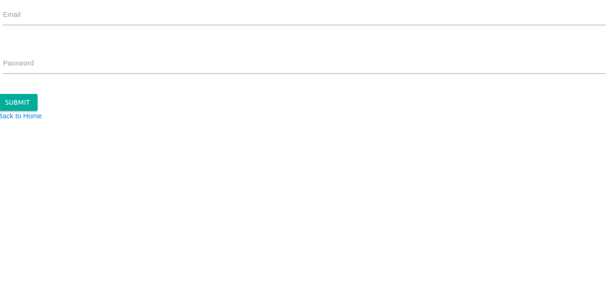

# Basic Authentication 

Basic authentication for login, created with React, using React Router. With Home, Admin and Login component. 


---




## Installation

1. We require either `Yarn` or `Node` installed in our computer before starting the project
2. Create in the terminal a new folder, with a `index.html` and a `index.js`
3. Now we can initialize the project by running `npm init` (or `yarn init`). This will create our `package-json`, where we will be adding the dependencies, and the `node-moduler` folder will be created as well. 
4. Then, we will install React from terminal `npm install react`,`npm install react react-dom`, `npm install --save react-router`
(i will continue with `npm`, since i am using `Node`)
5. Next, we will install `webpack` , `npm install --save-dev webpack` 
6. Now we need a config file to give it instructions on what to do : `webpack.config.js`, and open it with the text-editor of your choice. This is what we need : 
 ```const path = require("path");

var config = {
  entry: './src/index.js',
  output: {
    path: path.resolve(__dirname, "./src"),
    filename: 'bundle.js',
    publicPath: './src'
  },
  devServer: {
    inline: true,
    port: 8080,
  },

  module: {
    rules: [
      { test: /\.css$/, loader: "style-loader!css-loader" },
      {
        test: /\.jsx?$/,
        exclude: /node_modules/,
        loader: 'babel-loader',
        query: {
          presets: ['es2015', 'react']
        }
      },
    ],
  }

}
module.exports = config; ```


```
6. We will need other dependecies, like `babel`, 
so that our package-json, will looks like this: 
```
{
  "name": "basic_authentication",
  "version": "1.0.0",
  "description": "",
  "main": "index.js",
  "scripts": {
    "client": "webpack -d -w --display-max-modules 0",
    "build": "webpack -p --optimize-minimize",
    "start": "npm run client"
  },
  "dependencies": {
    "axios": "^0.18.0",
    "babel-cli": "^6.26.0",
    "babel-core": "^6.26.0",
    "babel-loader": "^7.1.2",
    "babel-polyfill": "^6.26.0",
    "babel-preset-env": "^1.6.1",
    "babel-preset-es2015": "^6.24.1",
    "babel-preset-react": "^6.24.1",
    "babel-register": "^6.26.0",
    "body-parser": "~1.18.2",
    "bootstrap": "^4.0.0-beta.2",
    "dotenv": "^4.0.0",
    "express": "~4.15.5",
    "materialize-css": "^1.0.0-beta",
    "mongoose": "^5.0.0-rc1",
    "pug": "^2.0.3",
    "react": "^16.3.2",
    "react-dom": "^16.3.2",
    "react-router": "^4.2.0",
    "react-router-dom": "^4.2.2",
    "webpack": "^4.5.0",
    "webpack-cli": "^2.0.14",
    "webpack-dev-server": "^3.1.3",
    "webpack-node-externals": "^1.6.0"
  },
  "devDependencies": {
    "babel-plugin-transform-object-rest-spread": "^6.26.0",
    "eslint": "^4.9.0",
    "eslint-plugin-react": "^7.4.0",
    "concurrently": "^3.5.0",
    "css-loader": "^0.28.11",
    "style-loader": "^0.20.3",
    "nodemon": "^1.12.1"
  },
  "babel": {
    "presets": [
      "env",
      "react"
    ]
  },
  "author": "Marta",
  "license": "ISC"
}

```
   
7. Now we can install everthing from the terminal, with `npm install`. 
8. We can create a `.gitignore` file, adding the `_node-modules`


---


# Instructions

1. The `index.html` is the actual webpage which loads our React Components on the browser, we will need an entry point, with an empty div with id `root`
2. We need a file called `App.jsx`, our main Component. We initialize like this:
```
import React from 'react';

export default class App extends React.Component {
  render() {
    return (
     <div>
        <h1>Hello World</h1>
      </div>);
  }
}
export default App;
```
4. We render our component from our start file, `index.js`  :
```
import React from 'react';
import ReactDOM from 'react-dom';
import App from './components/App.jsx';

ReactDOM.render(<App />, document.getElementById('root'));
```
5. Now finally we can start our project typing in the terminal `npm start`.
